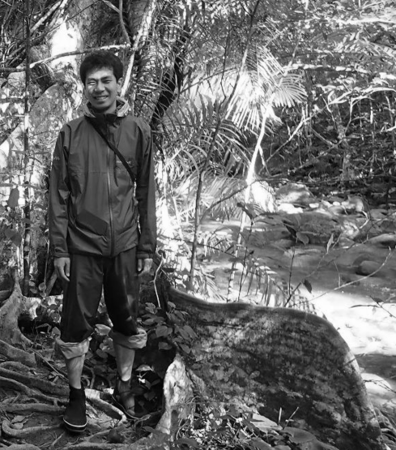

--- 
title: "TAKAHIRO YOSHIDA'S WEBSITE"
author: ""
date: "April, 2020"
site: bookdown::bookdown_site
output: bookdown::gitbook
documentclass: book
bibliography: [book.bib, packages.bib]
biblio-style: apalike
link-citations: yes
description: "This is Takahiro Yoshida's website."
---

# Welcome! {-}

## About {-}

**Takahiro Yoshida** (吉田 崇紘) is a Research Associate of Center for Global Environmental Research, National Institute for Environmental Studies, Japan. He received his Ph.D. degree in Policy and Planning Sciences from University of Tsukuba, 2018. His research interests include: geographical information sciences (GIS, GISc), remote sensing, spatial econometrics, spatial statistics, compositional data analysis, and urban analysis.

### Education {-}

- Ph.D. in Policy and Planning Sciences, University of Tsukuba, March 2018.
    - [Dissertation title] Methodological developments and socio-economic applications of compositional data analysis for geographical data.
- M.Sc. in Engineering, University of Tsukuba, March 2015.
- B.Sc. in Policy and Planning Sciences, University of Tsukuba, March 2013.

### Work experience {-}

- April 2019 – present
    - Part-Time Lecturer,  Department of International Economics, Faculty of Economics, Toyo University, Japan.
- April 2018 – present
    - Research Associate,  Center for Global Environmental Research,
    National Institute for Environmental Studies, Japan.
- April 2016 – March 2018
    - Research Fellow (DC2),  Japan Society for the Promotion of Science, Japan.

---

## Contact {-}

- Phone: +81-29-850-2567 
- E-mail: yoshida.takahiro *at* nies.go.jp
- Address: 16-2 Onogawa, Tsukuba, Ibaraki 305-8506, Japan

# Publications {-}

## In progress / under review {-}

- Hajime Seya, Takahiro Yoshida  
**Propensity score matching for multiple treatment levels: A CODA-based contribution.**  
arXiv: 1710.08558 [[LINK](https://arxiv.org/abs/1710.08558)]

- Takahiro Yoshida, Daisuke Murakami, Hajime Seya, Morito Tsutsumi  
**A Monte Carlo study: Spatial multinomial discrete choice models.**  
presented at the Spatial Econometrics Association 2016

- Takahiro Yoshida, Daisuke Murakami, Hajime Seya, Morito Tsutsumi  
**Spatial seemingly unrelated regression models combined with compositional data analysis approach.**  
presented at the Spatial Econometrics Association 2019 

- Takahiro Yoshida, Masato Tomonari, Hajime Seya, Morito Tsutsumi  
**On the relationships between amount of zero responses and goodness-of-fits of compositional models.**

- Takahiro Yoshida, Daisuke Murakami, Narumasa Tsutsumida, Tomoki Nakaya  
**GWRComp: Geographically weighted regression for compositional data.** 

- Takahiro Yoshida, Morito Tsutsumi, Hozana Ishii  
**Identification of regional difference of election voting trends: Functional compositional data clustering approach.** 

- &#043; six papers are under review. One book and one translation are coming soon. 

---

## Refereed papers {-}

1. Daisuke Murakami, Narumasa Tsutsumida, Takahiro Yoshida, Tomoki Nakaya, Binbin Lu (2020)  
**Scalable GWR: A Linear-time algorithm for large-scale geographically weighted regression with polynomial kernels.**   
*Annals of the American Association of Geographers*, accepted.  
DOI: in press.
1. Takuro Kobashi, Kelvin Say, Jiayang Wang, Masaru Yarime, Dong Wang, Takahiro Yoshida, Yoshiki Yamagata (2020)  
**Techno-economic assessment of photovoltaics plus electric vehicles towards household-sector decarbonization in Kyoto and Shenzhen by the year 2030.**  
*Journal of Cleaner Production,* 253, 119933.  
DOI: 10.1016/j.jclepro.2019.119933 [[LINK](https://doi.org/10.1016/j.jclepro.2019.119933)]
1. Takahiro Yoshida, Rim Er-rbib, Morito Tsutsumi (2019)  
**Which country epitomizes the world? A study from the perspective of demographic composition.**  
*Sustainability,* 11 (22), 6404.  
DOI: 10.3390/su11226404 [[LINK](https://www.mdpi.com/2071-1050/11/22/6404)]
1. Michael B. Tobey, Robert B. Binder, Soowon Chang, Takahiro Yoshida, Yoshiki Yamagata, Perry P. J. Yang (2019)  
**Urban systems design: A conceptual framework for planning smart communities.**  
*Smart Cities,* 2 (4), 522–537.  
DOI: 10.3390/smartcities2040032 [[LINK](https://www.mdpi.com/2624-6511/2/4/32)]
1. Michael B. Tobey, Robert B. Binder, Takahiro Yoshida, Yoshiki Yamagata (2019)  
**Urban systems design case study: Tokyo's Sumida ward.**  
*Smart Cities,* 2 (4), 453–470.  
DOI: 10.3390/smartcities2040028 [[LINK](https://www.mdpi.com/2624-6511/2/4/28)]
1. Yoshiki Yamagata, Takahiro Yoshida, Daisuke Murakami, Tomoko Matsui, Yuki Akiyama (2018)  
**Seasonal urban carbon emission estimation using spatial micro big data.**  
*Sustainability,* 10 (12), 4472.  
DOI: 10.3390/su10124472 [[LINK](https://www.mdpi.com/2071-1050/10/12/4472)]
1. Takahiro Yoshida, Morito Tsutsumi (2018)  
**On the effects of spatial relationships in spatial compositional multivariate models.**  
*Letters in Spatial and Resource Sciences,* 11 (1), 57–70.  
DOI: 10.1007/s12076-017-0199-5 [[LINK](https://link.springer.com/article/10.1007/s12076-017-0199-5)]
1. Takahiro Yoshida, Morito Tsutsumi (2017)  
**The epitome of the future Japan from the perspective of demographic composition: Application of compositional data analysis to population studies.**  
*Theory and Applications of GIS,* 25 (2), 79–89.  
DOI: 10.5638/thagis.25.79 [in Japanese] [[LINK](https://www.jstage.jst.go.jp/article/thagis/25/2/25_79/_article/-char/en)]
1. Daisuke Murakami, Takahiro Yoshida, Hajime Seya, Daniel A. Griffith, Yoshiki Yamagata (2017)  
**A Moran coefficient-based mixed effects approach to investigate spatially varying relationships.**  
*Spatial Statistics,* 19, 68–89.  
DOI: 10.1016/j.spasta.2016.12.001 [[LINK](http://www.sciencedirect.com/science/article/pii/S2211675316301798)]
1. Hajime Seya, Takahiro Yoshida, Morito Tsutsumi (2016)  
**Ex-post identification of geographical extent of benefited area by a transportation project: Functional data analysis method.**  
*Journal of Transport Geography,* 55, 1–10.  
DOI: 10.1016/j.jtrangeo.2016.07.004 [[LINK](http://www.sciencedirect.com/science/article/pii/S0966692316303763)]
1. Yoshiki Yamagata, Daisuke Murakami, Takahiro Yoshida, Hajime Seya, Sho Kuroda (2016)  
**Value of urban views in a bay city: Hedonic analysis with the spatial multilevel additive regression (SMAR) model.**  
*Landscape and Urban Planning,* 151, 89–102.  
DOI: 10.1016/j.landurbplan.2016.02.008 [[LINK](http://www.sciencedirect.com/science/article/pii/S0169204616000232)]

---

## Refereed full paper proceedings {-}

1. Narumasa Tsutsumida, Takahiro Yoshida, Daisuke Murakami, Tomoki Nakaya (2020)  
**A Geographically weighted total composite error analysis for soft classification.**  
*Proceedings of the 2020 IEEE Geoscience and Remote Sensing Society Symposium,* in press.  
DOI: in press [LINK] 
    - This paper will be presented at the 40th annual conference of the IEEE Geoscience and Remote Sensing Society (IGARSS2020), Hawaii, USA, July 19–24, 2020.
1. Soowon Chang, Takahiro Yoshida, Robert Binder, Yoshiki Yamagata, Daniel Castro-Lacouture (2020)  
**Energy sharing boundaries integrating buildings and vehicles tangled in spatial and temporal changes.**  
*Proceedings of the ASCE Construction Research Congress 2020,* 484.  
DOI: in press [LINK]  
    - This paper was presented at the ASCE Construction Research Congress 2020 (ASCE CRC2020), Tempe, Arizona, USA, March 8–10, 2020.
1. Takahiro Yoshida, Yoshiki Yamagata, Daisuke Murakami (2019)  
**Spatially detail urban carbon mapping: Integration of top-down and bottom-up approaches.**  
*Proceedings of the 15th International Conference on Geocomputation,* 7.3.  
DOI: 10.17608/k6.auckland.9848738.v1 [[LINK](https://doi.org/10.17608/k6.auckland.9848738.v1)]  
    - This paper was presented at the 15th International Conference on Geocomputation (Geocomputation2019), Queenstown, New Zealand, September 18–21, 2019.
1. Yoshiki Yamagata, Takahiro Yoshida, Haruna Matsui, Perry Yang, Chen Helen (2019)  
**Experiential modelling of urban street: a combining approach with neural image assessment and street experiment.**  
*Proceedings of the 15th International Conference on Geocomputation,* 8.6.  
DOI: 10.17608/k6.auckland.9848270.v1 [[LINK](https://doi.org/10.17608/k6.auckland.9848270.v1)]  
    - This paper was presented at the 15th International Conference on Geocomputation (Geocomputation2019), Queenstown, New Zealand, September 18–21, 2019.
1. Daisuke Murakami, Narumasa Tsutsumida, Takahiro Yoshida, Tomoki Nakaya, Binbin Lu (2019)  
**Scalable geographically weighted regression for big data.**  
*Proceedings of the 15th International Conference on Geocomputation,* 6.4.  
DOI: 10.17608/k6.auckland.9850898.v1 [[LINK](https://doi.org/10.17608/k6.auckland.9850898.v1)]  
    - This paper was presented at the 15th International Conference on Geocomputation (Geocomputation2019), Queenstown, New Zealand, September 18–21, 2019.
1. Narumasa Tsutsumida, Daisuke Murakami, Takahiro Yoshida, Tomoki Nakaya, Binbin Lu, Paul Harris (2019)  
**Geographically Weighted Non-negative Principal Component Analysis for Exploring Spatial Variation in Multidimensional Composite Index.**  
*Proceedings of the 15th International Conference on Geocomputation,* 6.5.  
DOI: 10.17608/k6.auckland.9850826.v1 [[LINK](https://doi.org/10.17608/k6.auckland.9850826.v1)]  
    - This paper was presented at the 15th International Conference on Geocomputation (Geocomputation2019), Queenstown, New Zealand, September 18–21, 2019.
1. Takahiro Yoshida, Soowon Chang, Daisuke Murakami, Yoshiki Yamagata (2019)  
**The relationships between energy consumption and surface temperature: A combining multiple-scale observations approach.**  
*Proceedings of the 11th International Conference on Applied Energy*, Part 3, ID: 0940.  
Available at: [[Link](http://www.energy-proceedings.org/the-relationship-between-energy-consumption-and-surface-temperature-combining-multiple-scale-observations/)]  
    - This paper was presented at the 11th International Conference on Applied Energy (ICAE2019), Vasteras, Sweden, August 12–15, 2019.
1. Takuro Kobashi, Takahiro Yoshida, Katsuhiko Naito, Stefan Pfenninger, Yoshiki Yamagata (2019)  
**Cost-optimal pathways to decarbonize urban energy systems with PV, batteries, and electric vehicles: A case study for Kyoto, Japan.**  
*Proceedings of the 11th International Conference on Applied Energy*, Part 2, ID: 0107.  
Available at: [[Link](http://www.energy-proceedings.org/cost-optimal-pathways-to-decarbonize-urban-energy-systems-with-pv-batteries-and-electric-vehicles-a-case-study-for-kyoto-japan/)]  
    - This paper was presented at the 11th International Conference on Applied Energy (ICAE2019), Vasteras, Sweden, August 12–15, 2019.
1. Soowon Chang, Takahiro Yoshida, Michael Tobey, Yoshiki Yamagata, Perry Yang (2019)  
**Trandformative model of urban buildings optimizing energy demands, solar harvesting potential, and indoor thermal comfort.**  
*Proceedings of the 11th International Conference on Applied Energy*, Part 4: ID: 0355.  
Available at: [[Link](http://www.energy-proceedings.org/transformative-model-of-urban-buildings-optimizing-energy-demands-solar-harvesting-potential-and-indoor-thermal-comfort/)]  
    - This paper was presented at the 11th International Conference on Applied Energy (ICAE2019), Vasteras, Sweden, August 12–15, 2019.
1. Michael Tobey, Soowon Chang, Takahiro Yoshida, Robert Binder, Yoshiki Yamagata (2019)  
**Measuring resiliencce, economy, sustainability, and human well-being in multiple scales for urban diagnostics.**  
*Proceedings of the 11th International Conference on Applied Energy*, Part 1, ID: 0904.  
Available at: [[Link](http://www.energy-proceedings.org/measuring-resilience-economy-sustainability-and-human-wellbeing-in-multiple-scales-for-urban-diagnostics/)]  
    - This paper was presented at the 11th International Conference on Applied Energy (ICAE2019), Vasteras, Sweden, August 12–15, 2019.
1. Yoshiki Yamagata, Daisuke Murakami, Takahiro Yoshida (2019)  
**Spatiotemporal heatwave risk evaluation: Considering hazard, exposure, and vulnerability.**  
*Proceedings of the 2019 IEEE Geoscience and Remote Sensing Society Symposium,* 5524–5527.  
DOI: 10.1109/IGARSS.2019.8898442 [[LINK](https://ieeexplore.ieee.org/document/8898442)]  
    - This paper was presented at the 39th annual conference of the IEEE Geoscience and Remote Sensing Society (IGARSS2019), Yokohama, Japan, July 28–August 2, 2019.
1. Daisuke Murakami, Yoshiki Yamagata, Takahiro Yoshida, Tomoko Matsui (2019)  
**Spatiotemporal heatwave risk modeling combining multiple observations.**  
*Proceedings of the 2019 IEEE Geoscience and Remote Sensing Society Symposium,* 5516–5519.  
DOI: 10.1109/IGARSS.2019.8898761 [[LINK](https://ieeexplore.ieee.org/document/8898761)]  
    - This paper was presented at the 39th annual conference of the IEEE Geoscience and Remote Sensing Society (IGARSS2019), Yokohama, Japan, July 28–August 2, 2019.
1. Daisuke Murakami, Tomoko Matsui, Takahiro Yoshida, Yoshiki Yamagata (2019)  
**A GPS-based simple evaluation simulation approach: Case study in Joso, Japan.**  
*Proceedings of the 2019 IEEE Geoscience and Remote Sensing Society Symposium,* 5636–5637.  
DOI: 10.1109/IGARSS.2019.8898041 [[LINK](https://ieeexplore.ieee.org/document/8898041)]  
    - This paper was presented at the 39th annual conference of the IEEE Geoscience and Remote Sensing Society (IGARSS2019), Yokohama, Japan, July 28–August 2, 2019.
1. Takahiro Yoshida, Kei Hiroi, Yoshiki Yamagata, Daisuke Murakami (2019)  
**Verification on evaluation of flood disaster by using GPS: Case study in Mabi, Japan 2018.**  
*Proceedings of the 2019 IEEE Geoscience and Remote Sensing Society Symposium,* 5633–5635.  
DOI: 10.1109/IGARSS.2019.8898574 [[LINK](https://ieeexplore.ieee.org/document/8898574)]  
    - This paper was presented at the 39th annual conference of the IEEE Geoscience and Remote Sensing Society (IGARSS2019), Yokohama, Japan, July 28–August 2, 2019.
1. Takahiro Yoshida, Yoshiki Yamagata, Daisuke Murakami (2019)  
**Individual level heat risk evaluation using GPS towards smart navigation system.**  
*Proceedings of the International Cartographic Association,* 2, 152.  
DOI: 10.5194/ica-proc-2-152-2019 [[LINK](https://www.proc-int-cartogr-assoc.net/2/152/2019/)]  
    - This paper was presented at the 29th International Cartographic Conference (ICC2019), Tokyo, Japan, July 15–20, 2019.
1. Takahiro Yoshida, Michael Tobey, Soowon Chang, Yoshiki Yamagata (2019)  
**Carbon emission intensities of each building typology: Towards a standardized framework.**  
*Proceedings of the 16th International Conference on Computers in Urban Planning and Urban Management* (July 8–12, 2019; Wuhan, China), 799185.  
    - This paper was presented at the 16th International Conference on Computers in Urban Planning and Urban Management (CUPUM2019), Wuhan, China, July 8–12, 2019.
1. Michael Tobey, Robert Binder, Takahiro Yoshida, Yoshiki Yamagata (2019)  
**Urban systems design applicability case study: Applying urban systems design framework to North Sumida Ward Tokyo.**  
*Proceedings of the 16th International Conference on Computers in Urban Planning and Urban Management* (July 8–12, 2019; Wuhan, China), 798881.  
    - This paper was presented at the 16th International Conference on Computers in Urban Planning and Urban Management (CUPUM2019), Wuhan, China, July 8–12, 2019.
1. Michael Tobey, Robert Binder, Soowon Chang, Takahiro Yoshida, Yoshiki Yamagata, Perry Yang (2019)  
**Urban systems design conceptual framework: Modeling, design, and emergent iterative smart communities.**  
*Proceedings of the 16th International Conference on Computers in Urban Planning and Urban Management* (July 8–12, 2019; Wuhan, China), 798833.  
    - This paper was presented at the 16th International Conference on Computers in Urban Planning and Urban Management (CUPUM2019), Wuhan, China, July 8–12, 2019.
1. Takahiro Yoshida, Yoshiki Yamagata, Anna Ebata, Daisuke Murakami, Kanae Matsui (2019)  
**Estimating quasi-real-time building energy demand using occupancy information: A case study in Sumida, Tokyo.**  
*Proceedings of the CIB World Building Congress 2019* (June 17–21, 2019; Hong Kong, China), 130–136.  
Available at: [[LINK](https://site.cibworld.nl/dl/publications/WBC19/WBC_Proceedings_June2019_Complete.pdf)]  
    - This paper was presented at International Council for Research and Innovation in Building and Construction World Building Congress (CIBWBC2019), Hong Kong, China, June 17–21, 2019.
1. Soowon Chang, Takahiro Yoshida, Kanae Matsui, Daniel Castro-Lacouture, Yoshiki Yamagata (2019)  
**A sustainability provision system of energy demands and indoor thermal comfort by integrating building energy models with IoT: Focusing on residential building in Kyojima, Tokyo.**  
*Proceedings of the CIB World Building Congress 2019* (June 17–21, 2019; Hong Kong, China), 137–146.  
Available at: [[LINK](https://site.cibworld.nl/dl/publications/WBC19/WBC_Proceedings_June2019_Complete.pdf)]  
    - This paper was presented at International Council for Research and Innovation in Building and Construction World Building Congress (CIBWBC2019), Hong Kong, China, June 17–21, 2019.
1. Yoshiki Yamagata, Takahiro Yoshida, Daisuke Murakami (2019)  
**Modeling uncertainty in electricity resilient community clustering: a spatial BigData approach.**  
*Proceedings of the CIB World Building Congress 2019* (June 17–21, 2019; Hong Kong, China), 123–129.  
Available at: [[LINK](https://site.cibworld.nl/dl/publications/WBC19/WBC_Proceedings_June2019_Complete.pdf)]  
    - This paper was presented at International Council for Research and Innovation in Building and Construction World Building Congress (CIBWBC2019), Hong Kong, China, June 17–21, 2019.
1. Kei Hiroi, Takahiro Yoshida, Yoshiki Yamagata, Nobuo Kawaguchi (2019)  
**Flood area estimation using personal location data: Case study of Japan floods in 2018.**  
*Proceedings of the 2019 IEEE International Conference on Pervasive Computing and Communications,* 285–291.  
DOI: 10.1109/percomw.2019.8730882 [[LINK](https://ieeexplore.ieee.org/document/8730882)]  
    - This paper was presented at the 4th IEEE International Workshop on Pervasive Context-Aware Smart Cities and Intelligent Transport Systems (PerAwareCity2019) in conjunction with the 17th IEEE Pervasive Computing and Communications (PerCom2019), Kyoto, Japan, March 11–15, 2019.
1. Takahiro Yoshida, Yoshiki Yamagata, Daisuke Murakami (2019)  
**Energy demand estimation using quasi-real-time people activity data.**  
*Energy Procedia,* 158, 4172–4177.  
DOI: 10.1016/j.egypro.2019.01.813 [[LINK](https://www.sciencedirect.com/science/article/pii/S1876610219308537)]  
    - This paper was presented at the 10th International Conference on Applied Energy (ICAE2018), Hong Kong, China, August 22–25, 2018.
1. Daisuke Murakami, Yoshiki Yamagata, Takahiro Yoshida, Tomoko Matsui (2019)  
**Optimization of local microgrid model for energy sharing considering daily variations in supply and demand.**  
*Energy Procedia,* 158, 4109–4114.  
DOI: 10.1016/j.egypro.2019.01.823 [[LINK](https://www.sciencedirect.com/science/article/pii/S187661021930863X)]  
    - This paper was presented at the 10th International Conference on Applied Energy (ICAE2018), Hong Kong, China, August 22–25, 2018.
1. Yoshiki Yamagata, Daisuke Murakami, Yihan Wu, Perry Pei-Ju Yang, Takahiro Yoshida, Robert Binder (2019)  
**Big-data analysis for carbon emission reduction from cars: Towards walkable green smart community.**  
*Energy Procedia,* 158, 4292–4297.  
DOI: 10.1016/j.egypro.2019.01.795 [[LINK](https://www.sciencedirect.com/science/article/pii/S1876610219308331)]  
    - This paper was presented at the 10th International Conference on Applied Energy (ICAE2018), Hong Kong, China, August 22–25, 2018.
1. Takahiro Yoshida, Yoshiki Yamagata, Daisuke Murakami (2018)  
**Dynamic carbon mapping with micro-urban simulations towards urban system design of near zero.**  
*Proceedings of the 2018 Council of Engineering Systems Universities* (June 20–22, 2018; Tokyo, Japan), SU2-1.  
    - This paper was presented at the Council of Engineering Systems Universities 2018 Global Conference (CESUN2018), Tokyo, Japan, June 20–22, 2018.
1. Ayyoob Sharifi, Yihan Wu, Dararat Khamchiangta, Takahiro Yoshida, Yoshiki Yamagata (2018)  
**Urban carbon mapping: Towards a standardized framework.**  
*Energy Procedia,* 152, 799–808.  
DOI: 10.1016/j.egypro.2018.09.193 [[LINK](https://www.sciencedirect.com/science/article/pii/S1876610218307379)]  
    - This paper was presented at the Applied Energy Symposium and Forum: Low carbon cities and urban energy systems (CUE2018), Shanghai, China, June 5–7, 2018.
1. Yoshiki Yamagata, Daisuke Murakami, Takahiro Yoshida (2017)  
**Dynamic urban carbon mapping with spatial big data.**  
*Energy Procedia,* 142, 2461–2466.  
DOI: 10.1016/j.egypro.2017.12.183 [[LINK](https://www.sciencedirect.com/science/article/pii/S1876610217359131)]  
    - This paper was presented at the 9th International Conference on Applied Energy (ICAE2017), Cardiff, UK, August 21–24, 2017.

---

## Book chapters {-}

1. Yoshiki Yamagata, Takahiro Yoshida (2020)   
**Kyojima smart community studio: Urban systems design.**   
In Thomas Fisher, Brian Orland, Carl Steinitz (eds.)   
*The International Geodesign Collaboration: Changing Geography by Design*, 132–133. Esri Press.  
[[LINK](https://esripress.esri.com/display/index.cfm?fuseaction=display&websiteID=388&moduleID=0)]
1. Yoshiki Yamagata, Takahiro Yoshida, Perry P. J. Yang, Helen Chen, Daisuke Murakami, Leena Ilmola (2020)   
**Measuring quality of walkable urban environment through experiential modeling.**   
In Yoshiki Yamagata, Perry P. J. Yang (eds.)   
*Urban Systems Design: Creating Sustainable Smart Cities in the Internet of Things Era,* 373–392. Elsevier.   
DOI: 10.1016/B978-0-12-816055-8.00012-9 [[LINK](https://www.elsevier.com/books/urban-systems-design/yamagata/978-0-12-816055-8)]
1. Takuro Kobashi, Yoshiki Yamagata, Takahiro Yoshida, Soowon Chang, Yasunori Mochizuki, Amanda Ahl, Jelena Aleksejeva (2020)   
**Smart city and ICT infrastructure with vehicle to X applications toward urban decarbonization.**   
In Yoshiki Yamagata, Perry P. J. Yang (eds.)   
*Urban Systems Design: Creating Sustainable Smart Cities in the Internet of Things Era,* 289–333. Elsevier.   
DOI: 10.1016/B978-0-12-816055-8.00009-9 [[LINK](https://www.elsevier.com/books/urban-systems-design/yamagata/978-0-12-816055-8)]
1. Yoshiki Yamagata, Takahiro Yoshida, Soowon Chang, Peraphan Jittrapirom, Sylvia Coleman, John Robinson, Roger Cremades, Dirk Neumann (2020)   
**Case studies towards smart communities.**   
In Yoshiki Yamagata, Perry P. J. Yang (eds.)   
*Urban Systems Design: Creating Sustainable Smart Cities in the Internet of Things Era,* 257–288. Elsevier.   
DOI: 10.1016/B978-0-12-816055-8.00008-7 [[LINK](https://www.elsevier.com/books/urban-systems-design/yamagata/978-0-12-816055-8)]
1. Takahiro Yoshida, Yoshiki Yamagata, Soowon Chang, Vincent de Gooyert, Hajime Seya, Daisuke Murakami, Peraphan Jittrapirom, Gerasimos Voulgaris (2020)   
**Spatial modelling and design of smart communities.**  
In Yoshiki Yamagata, Perry P. J. Yang (eds.)   
*Urban Systems Design: Creating Sustainable Smart Cities in the Internet of Things Era,* 199–255. Elsevier.  
DOI: 10.1016/B978-0-12-816055-8.00007-5 [[LINK](https://www.elsevier.com/books/urban-systems-design/yamagata/978-0-12-816055-8)]
1. Yoshiki Yamagata, Perry P. J. Yang, Soowon Chang, Michael B. Tobey, Robert B. Binder, Pieter J. Fourie, Peraphan Jittrapirom, Takuro Kobashi, Takahiro Yoshida, Jelena Aleksejeva (2020)  
**Urban systems and the role of big data.**  
In Yoshiki Yamagata, Perry P. J. Yang (eds.)  
*Urban Systems Design: Creating Sustainable Smart Cities in the Internet of Things Era*, 23–58. Elsevier.  
DOI: 10.1016/B978-0-12-816055-8.00002-6 [[LINK](https://www.elsevier.com/books/urban-systems-design/yamagata/978-0-12-816055-8)]
1. Yoshiki Yamagata, Takahiro Yoshida (2019)  
**Tokyo smart city studio: An urban systems design approach.**  
In Sean Nicklin, Ben Cornwell, Leigh Trowbridge (eds.)  
*A Better World: Sustainable Cities and Communities*, 5, 32–35. Tudor Rose.  
[[LINK](http://unhabitat.org.mm/publications/a-better-world-volume-5/)]
1. Takahiro Yoshida, Yoshiki Yamagata (2019)  
**Quasi real time energy use estimation using Google's popular time data.**  
In Yoshiki Yamagata, Hajime Seya (eds.)  
*Spatial Analysis Using Big Data: Methods and Urban Applications,* 271–280. Academic Press.  
DOI: 10.1016/B978-0-12-813127-5.00011-4 [[LINK](https://www.elsevier.com/books/spatial-analysis-using-big-data/yamagata/978-0-12-813127-5)]
1. Yoshiki Yamagata, Daisuke Murakami, Takahiro Yoshida (2019)  
**Evaluating walkability using mobile GPS data.**  
In Yoshiki Yamagata, Hajime Seya (eds.)  
*Spatial Analysis Using Big Data: Methods and Urban Applications,* 239–257. Academic Press.  
DOI: 10.1016/B978-0-12-813127-5.00009-6 [[LINK](https://www.elsevier.com/books/spatial-analysis-using-big-data/yamagata/978-0-12-813127-5)]
1. Takahiro Yoshida, Daisuke Murakami (2019)  
**Implementation with R language.**  
In Yoshiki Yamagata, Hajime Seya (eds.)  
*Spatial Analysis Using Big Data: Methods and Urban Applications,* 181–223. Academic Press.  
DOI: 10.1016/B978-0-12-813127-5.00007-2 [[LINK](https://www.elsevier.com/books/spatial-analysis-using-big-data/yamagata/978-0-12-813127-5)]
1. Hajime Seya, Takahiro Yoshida, Yoshiki Yamagata (2019)  
**Spatial econometric models.**  
In Yoshiki Yamagata, Hajime Seya (eds.)  
*Spatial Analysis Using Big Data: Methods and Urban Applications,* 113–158. Academic Press.  
DOI: 10.1016/B978-0-12-813127-5.00005-9 [[LINK](https://www.elsevier.com/books/spatial-analysis-using-big-data/yamagata/978-0-12-813127-5)]
1. Takahiro Yoshida, Morito Tsutsumi (2017)  
**Cluster analysis.**  
In Committee of Infrastructure Planning and Management (eds.)  
*Handbook of Infrastructure Planning and Management*, 118–120. Corona Publishing.  
[in Japanese] [[LINK](http://www.coronasha.co.jp/doboku-hb.html)]

---

## Book translation {-}

1. Giuseppe Arbia (2014)  
***A Primer for Spatial Econometrics: With Applications in R.*** Palgrave Macmillan.  
Translated by: Morito Tsutsumi (supervision), Takahiro Yoshida, Kazuki Tamesue, Keisuke Takano, Masato Tomonari (2016) ―. Keiso shobo.  
[in Japanese] [[LINK](http://www.keisoshobo.co.jp/book/b222571.html)]

# Honors {-}

## Awards {-}

- **Excellent Research Presentation Award**, CSIS DAYS 2018 (Center for Spatial Information Science, The University of Tokyo), November 2018.  
(with Yoshiki Yamagata, Daisuke Murakami, and Tomoko Matsui) 
- **GISA Award: Research Initiative Category**, GIS Association of Japan, October 2018. [[LINK](http://www.gisa-japan.org/file/nl108.pdf)]
- **Poster Session Award**, GIS Association of Japan, October 2018.  
(with Anna Ebata, Kazuki Tamesue, Hajime Seya, and Morito Tsutsumi)
- **Map Gallery Award (the second place)**, ESRI Japan, Corp., May 2018.  
(with Anna Ebata)
- **Young Scholar Award**, Environmental Systems Research Institute (ESRI), Inc., July 2017. [[LINK](https://www.esrij.com/cgi-bin/wp/wp-content/uploads/2017/01/YSA-Taiken2017.pdf)]
- **President's Award**, University of Tsukuba, March 2017.  
(with Marisa Yamaguchi and Rim Er-Rbib)
- **Poster Session Award**, GIS Association of Japan, October 2016.  
(with Morito Tsutsumi)
- **Map Gallery Award (the fourth place)**, ESRI Japan, Corp., May 2016.  
(with Shuhei Adachi, Yoi Kana, and Naoya Yanagisawa)
- **Best Student Award**, Graduate School of Systems and Information Engineering, University of Tsukuba, March 2015.
- **S-PLUS Student Research Encouragement Award (the first place)**, NTT DATA Mathematical Systems, Inc., November 2014.
- **Excellent Presentation Award**, GIS Association of Japan, November 2014.

---

## Research Grants {-}

### Principal Investigator {-}

- April 2016 – March 2018
    - Grant-in-Aid for JSPS Fellows,  
    Japan Society for the Promotion of Science.
- October 2015 – March 2016
    - Young Scientist Cultivation Program,  
    Graduate School of Systems and Information Engineering, University of Tsukuba.

### Co-Investigator {-}

- April 2019 – present
    - Grant-in-Aid for Challenging Research (Exploratory) (PI: Morito Tsutsumi),  
    Japan Society for the Promotion of Science.
- June 2018 – present
    - Collaboration Program at Joint Support-Center for Data Science Research (PI: Narumasa Tsutsumida),  
    Research Organization of Information and Systems.

# Note {-}

- I will post my codes and results here. As an example, I published the website below along with my great colleagues. 
    - [Gridded GDP projections compatible with the five SSPs](https://gcp-tsukuba.github.io/SSP-downscale/)
- Tentatively, my code-based weblog is posted in [Qiita](https://qiita.com/3tky) (in Japanese).
- This website is powered by [bookdown](https://github.com/rstudio/bookdown).

`r if (knitr:::is_html_output()) '
'`

